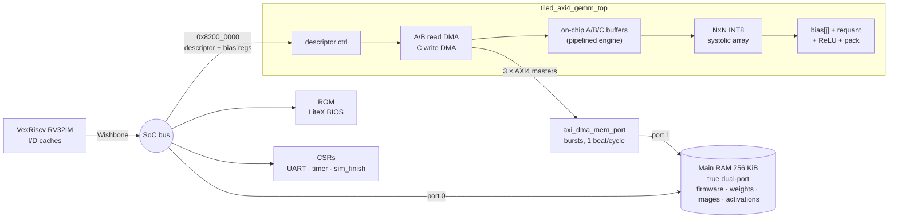

# RISC-V SoC integration: running a trained network on the accelerator

This directory boots a **VexRiscv RISC-V CPU** in a [LiteX](https://github.com/enjoy-digital/litex)
SoC with `tiled_axi4_gemm_top` attached. Bare-metal C firmware then runs a
trained INT8 handwritten-digits network **entirely through the accelerator's
DMA**. Everything runs cycle-accurately in Verilator, and CI runs it for both
array sizes and both memory-port modes.



## Run it

```bash
sudo apt-get install gcc-riscv64-unknown-elf libevent-dev libjson-c-dev   # + Verilator 5
bash soc/install_litex.sh                      # pinned LiteX/Migen/VexRiscv commits
python3 soc/run_soc_sim.py                    # 4x4 array, direct DMA memory port
python3 soc/run_soc_sim.py --array-n 8        # 8x8 array
python3 soc/run_soc_sim.py --mem-port bus     # DMA through the CPU interconnect instead
```

`run_soc_sim.py` builds the SoC, BIOS, firmware and Verilator model, boots
the CPU, and parses the firmware's `RESULT key=value` lines into
`build/soc/n<N>[_bus]/results.json`. It exits non-zero unless every check
passes and every hidden activation and logit is **bit-exact** with the Python
golden model. The runs behind the numbers below are in [`docs/results/`](../docs/results/).

| File | Role |
|---|---|
| `accel_soc.py` | LiteX SoC: VexRiscv, dual-port main RAM, the accelerator, and the DMA memory port |
| `firmware/main.c` | Bare-metal test and benchmark program (uses the portable driver in `sw/`) |
| `gen_model.py` | Trains the `ml/train_digits.py` MLP and bakes weights, test images and golden CRCs into `firmware/model_data.h` |
| `run_soc_sim.py` | Build + run + verdict, used by CI |
| `install_litex.sh` | Installs the exact LiteX commits this was validated with |
| [`../rtl/axi_dma_mem_port.sv`](../rtl/axi_dma_mem_port.sv) | Arbitrates the three AXI4 DMA masters onto the RAM's second port |

## What the firmware does

1. **GEMM self-test.** Eight random full-range INT8 shapes, from 1×1×1 up to
   64×64×64, including dimensions that aren't multiples of 4. Each result is
   compared word for word with a CPU reference.
2. **Robustness.** It programs an illegal descriptor (TILE_M=3). The core must
   raise ERROR without ever going BUSY, and the next legal job must still be
   correct. See *Bugs found* below.
3. **Digits MLP, CPU epilogue.** 360 held-out 8×8 digits through a 64→32→10
   network in batches of 64. Both matrix multiplies run on the accelerator; the
   CPU applies per-channel bias, requantization and ReLU.
4. **Digits MLP, fused.** Same network, with the epilogue done in hardware
   through the per-channel bias vector. Layer 1's INT8 output is DMA'd straight
   back to RAM as layer 2's input, so the CPU does no work between layers.
5. **CPU only.** Same network and same integer contract, for the baseline.

## Results (Verilator, cycle-accurate)

| | 4×4 array | 8×8 array |
|---|---:|---:|
| Accuracy, 360 held-out digits (all three paths) | 353/360 (98.06 %) | 353/360 (98.06 %) |
| Bit-exact with Python golden model (hidden + logits CRC) | ✅ | ✅ |
| CPU only, whole network | 9.77 M cycles | 9.99 M cycles |
| Accelerator + CPU epilogue | 0.65 M cycles (14.9×) | 0.61 M cycles (16.3×) |
| **Accelerator, fused epilogue** | **86.2 k cycles (113.3×)** | **43.4 k cycles (230.3×)** |
| 64×64×64 GEMM: CPU vs accelerator | 2.92 M vs 21.4 k cycles (136×) | 2.84 M vs 8.4 k cycles (339×) |

The CPU is a VexRiscv "standard" (RV32IM, hardware multiplier, 1-cycle bus to
on-chip RAM) compiled with `-O2`. Cycle counts come from the LiteX uptime
counter, read by the firmware, and include descriptor programming, polling and
cache maintenance. Each speed-up is measured against the CPU-only run in the
same firmware build. The 4×4 and 8×8 builds lay out code differently in the
instruction cache, which moves the CPU baseline by about 2 %.

### How the speed-up was earned: four measured steps

Each step started from a measurement, not a guess:

| Step | What the profile showed | Change | Fused network, 4×4 / 8×8 |
|---|---|---|---:|
| 0 | first working SoC | GEMMs on the accelerator, bias/requant on the CPU | 11.3× / 12.3× |
| 1 | CPU epilogue = **66 %** of accelerated runtime | per-channel bias vector in the RTL epilogue | 40.6× / 56.6× |
| 2 | PE array busy only **31 % / 13.5 %** of the time, even with ideal memory | pipelined `tiled_gemm_engine` | 73.5× / 105.8× |
| 3 | 64³ GEMM took ~31 k cycles at **both** array sizes: bus-bound | direct DMA port into main RAM | **113.3× / 230.3×** |

**Step 1: the epilogue.** With the original RTL, POST_BIAS is one scalar, but
a real layer needs one bias per output channel, so bias, requantization and
ReLU ran on the CPU: 570 k of 865 k cycles. A 64-entry bias vector in the RTL
epilogue made one descriptor compute a whole quantized layer.

**Step 2: the tile schedule.** [`sim/bench_axi4_gemm.py`](../sim/bench_axi4_gemm.py)
runs jobs against a one-beat-per-cycle memory model, isolating the
accelerator from the SoC. The reference path moved every output tile through
three serial hand-offs:

1. The tile buffer streams K vectors to the adapter over a 32-bit port.
2. The adapter feeds and drains the array.
3. N×N results travel one word per cycle through the K-accumulator and back.

Only then was the next tile issued: about 192 cycles for a 4×4×64 tile. The
new [`rtl/tiled_gemm_engine.sv`](../rtl/tiled_gemm_engine.sv) feeds the array
one full K vector per cycle straight from the on-chip operand buffers. It
reduces all of K in one pass, captures all N×N accumulators in the cycle the
array clears, and streams finished C rows while later rows compute. That
makes a tile K + 2N cycles.

| 64×64×64 GEMM, ideal memory | Reference path | Pipelined engine | Gain |
|---|---:|---:|---:|
| 4×4, INT32 out | 52.2 k cyc · 31 % PE util. | 20.4 k cyc · **80 %** | 2.6× |
| 8×8, INT32 out | 30.3 k cyc · 13.5 % | 9.3 k cyc · 44 % | 3.3× |
| 8×8, INT8 out | 27.3 k cyc · 15 % | 7.2 k cyc · 57 % | 3.8× |

The reference path is still in the RTL (`PIPELINED=0`) and CI runs it on both
simulators, so the two engines cross-check each other on every test.

**Step 3: the memory path.** With a fast engine, a 64³ INT32 GEMM still took
~31 k cycles in the SoC at *both* array sizes. LiteX bridges an AXI4 burst
into single Wishbone transfers (burst → beats → AXI-Lite → Wishbone), so every
DMA beat paid a full bus transaction and competed with the CPU. Main RAM is
now one true-dual-port memory: the CPU keeps port 0 on its Wishbone bus, and
[`rtl/axi_dma_mem_port.sv`](../rtl/axi_dma_mem_port.sv) gives the accelerator
port 1. This is the "high-performance port" arrangement of SoC FPGAs. The
port arbitrates A/B reads round-robin per burst, streams INCR bursts at one
beat per cycle through a two-entry skid buffer, and answers out-of-range or
misaligned bursts with SLVERR without touching RAM. The same step made the
driver load only the N bias entries a layer uses: entries at or beyond N are
never read, because the RTL column counter wraps at N.

| 64×64×64 INT32 GEMM in the SoC | via CPU bus (`--mem-port bus`) | direct port | Gain |
|---|---:|---:|---:|
| 4×4 | 31.6 k cycles | 21.4 k cycles | 1.5× |
| 8×8 | 31.1 k cycles | **8.4 k cycles** | **3.7×** |

At 8×8 the SoC is now faster than the ideal-memory benchmark (9.3 k), because
the SoC DMA issues 16-beat bursts and the benchmark's memory model uses 4.

### What is left

* **Driver overhead.** In the fused network, 8 k of the 43 k cycles (8×8) are
  the CPU programming 12 descriptors and polling for completion. Descriptor
  chaining, or an IRQ-driven driver that overlaps setup with the previous job,
  would recover most of that.
* **Drain bubble.** Each tile still spends 2N−1 cycles draining the array (15
  of 80 at 8×8, K=64). Overlapping the next tile's feed needs a per-PE tile
  boundary token. That changes the verified `pe_mac`/`systolic_array` core, so
  it deserves its own formal properties.
* **A real board.** These are cycle-accurate simulation results. The same SoC
  targets ECP5 boards (ULX3S, OrangeCrab) with LiteDRAM as main RAM.

## Bugs the end-to-end work found in `tiled_axi4_gemm_top`

The connected DMA top had been linted and synthesized, but never simulated end
to end. Driving it the way a CPU does (in `sim/test_axi4_gemm_top.py` and here)
exposed two defects. Both are fixed in `rtl/tiled_dma_shell.sv` and guarded by
mutants M31–M34:

* **DONE and the level IRQ could never be cleared.** The shell's
  "all movers finished" signal is a level that stays high until the next
  START. The register block sets DONE whenever that input is high, which
  overrides the write-one-to-clear. With IRQ_EN set, the interrupt line would
  stay asserted forever. The shell now reports each job's completion and first
  error exactly once.
* **One bad descriptor wedged the accelerator until hardware reset.** An
  illegal tile size was flagged by the scheduler, but the tile buffer then
  waited forever for a compute-done that never came, so BUSY stayed high and
  ABORT couldn't recover it. Descriptors are now checked at START: tile sizes,
  M/N/K range, and 4-byte alignment of the three base addresses. A rejected
  START raises ERROR one cycle later and moves no data.

## Notes for porting to an FPGA board

* **Caches.** The DMA writes results behind the CPU's back, so the firmware
  calls `flush_cpu_dcache()` after each job. VexRiscv's data cache is
  write-through, so operand buffers the CPU just wrote need no cleaning; a
  write-back cache would.
* **Output size.** Packed-INT8 writeback stores whole 32-bit words, so size
  output buffers to `ceil(M*N/4)*4` bytes.
* **IRQ.** The `irq` output is exported, but the firmware polls. Hooking it to
  a LiteX EventManager is a small change.
* **Memory.** On a board with DDR, main RAM becomes LiteDRAM. Give the
  accelerator its own LiteDRAM crossbar port (the DDR counterpart of
  `axi_dma_mem_port`), or fall back to `--mem-port bus`.
* **BIOS.** When main RAM is preloaded, the SoC sets `CONFIG_MAIN_RAM_INIT`.
  Otherwise the BIOS memory test overwrites the firmware, which was a real
  failure seen while bringing up the dual-port RAM.
